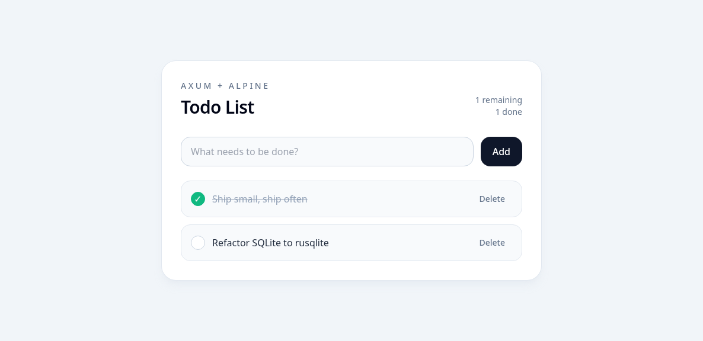

# Rust Todo Webapp

Simple full-stack todo app built with Rust and Axum. The backend serves both the JSON API and the single-page frontend. Todos are persisted in a local SQLite database file via `rusqlite`, so they survive server restarts.

## Live Demo

- Public demo: https://b5bb3110ce9a77.lhr.life
- GitHub repo: https://github.com/frodoclaw/rust-todo-webapp

> Note: the public demo runs through a temporary tunnel, so the URL may change or go offline when the local process stops.

## Downloads

- Every push to `main` and every pull request triggers a multi-platform build on GitHub Actions.
- Download build artifacts from the **Actions** tab: https://github.com/frodoclaw/rust-todo-webapp/actions
- When a tag like `v0.1.0` is pushed, GitHub will also publish zipped binaries to **Releases**.

Current targets:
- Linux x86_64
- Linux ARM64 / aarch64
- Windows x86_64
- macOS arm64

## Screenshot



## Stack

- Rust
- Axum
- Alpine.js via CDN
- TailwindCSS via CDN

## Features

- List todos
- Add a todo
- Toggle complete/incomplete
- Delete a todo
- JSON REST API under `/api/todos`

## Project Structure

```text
.
├── Cargo.toml
├── README.md
├── src/
│   └── main.rs
└── static/
    └── index.html
```

## Run Instructions

1. Install Rust using `rustup` if it is not already available.
2. Build the project:

   ```bash
   cargo build
   ```

3. Run the server:

   ```bash
   cargo run
   ```

   This creates `todo.db` in the project directory automatically on first startup.

   If port `3000` is already in use, run on another port:

   ```bash
   PORT=3001 cargo run
   ```

4. Open `http://127.0.0.1:3000` in your browser.
   If you used a custom port, open that port instead.

## Persistence

- Todos are stored in `todo.db` in the project directory.
- The `todos` table is created automatically when the app starts.
- Deleting `todo.db` resets the app back to an empty todo list.
- The `PORT` environment variable is still supported, for example `PORT=3001 cargo run`.

## API Endpoints

- `GET /api/todos`
- `POST /api/todos`
- `PATCH /api/todos/:id/toggle`
- `DELETE /api/todos/:id`

### Create Todo Example

```bash
curl -X POST http://127.0.0.1:3000/api/todos \
  -H "Content-Type: application/json" \
  -d '{"title":"Write docs"}'
```

## Notes

- Storage is backed by SQLite in `todo.db`.
- Static frontend assets are served by the Rust application.
